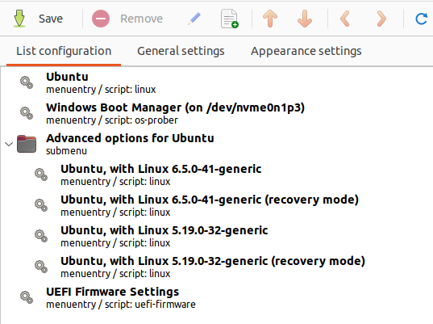
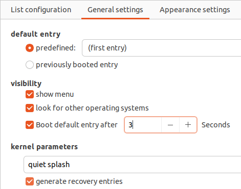
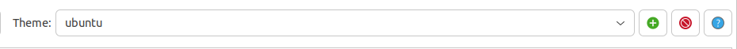
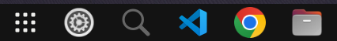
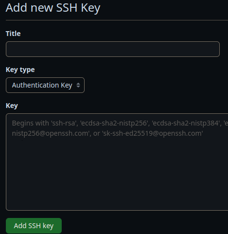

<!-- ~/xxxxxxxxxxxxxxxxxxxxxxxxxxxx: dotfiles/code/root/home/xxxxxxxxxxxxxxxxxxxxxxxxxxxx -->

<!-- dconf dump / > ~/.config/dconf/user.conf && code ~/.config/dconf/user.conf -->

<!--  -->

# Tải xuống

[Tải xuống download.sh](contents/dotfiles/others/download/download.sh)

<!--  -->

<!-- sudo apt-get install gnome-shell -->
<!-- gnome-shell --version -->

<!-- gsettings list-schemas -->
<!-- gnome-extensions list -->

<!-- sudo apt install gnome-shell-extension-prefs -->
<!-- gnome-extensions  --version  -->

<!--  -->

# Thủ công

## Chinh menu dual boot

Sử dụng mũi tên
Chinh thứ tự



Chinh thoi gian 3 giay?



Tai theme

theme trang chu:
https://www.gnome-look.org/browse?cat=109&ord=latest

trang theme cu the
https://www.gnome-look.org/p/1482847

Sau khi tai xuong cho vao folder
Download/Theme

Them theme bang dau +



## Cài đặt docker

<!-- https://docs.docker.com/desktop/install/ubuntu -->
<!-- https://www.youtube.com/watch?v=1_l-TNKPw-0 -->

[docker](contents/dotfiles/others/handmade/docker.sh)

Khởi động lai ubuntu

```
docker --version
docker-compose --version
```

## Cài đặt latex

[text](contents/dotfiles/others/handmade/latex.sh)

Thử file `main.tex`

```bash
pdflatex main.tex
```

<!-- Có thể bị lỗi  -->

Setting up context (2021.03.05.20220211-1) ...
Running mtxrun --generate. This may take some time... done.
Pregenerating ConTeXt MarkIV format. This may take some time...

## Cài đặt unikey

<!-- https://www.youtube.com/watch?v=SB_cjB4yBZc -->

Vào settings chọn Region & Language

Được hình ảnh như bên dưới thì chọn Manage Installed Languages


Có thông báo thì chọn Install

Nhập mật khẩu


Sau khi cài đặt xong thì chọn Close


Trong Region & Language chọn Language

Chọn thêm tiếng Việt


Khởi động lại máy tính


Vào settings chọn Keyboard


Chọn Input Sources

Chọn Vietnamese


Chọn Unikey


## Sắp xếp thứ tự Dock



## https://github.com/company20206205/nghia-github-gitconfig

Tai xuong

Chinh ten list_username

python3 nghia-github-gitconfig.py

## https://github.com/company20206205/nghia-github-ssh

Tai xuong

Tao file .env: SSH_PASSWORD=example

Chinh ten list_username

python3 nghia-github-ssh.py

code ~/.ssh

Them file_ssh.pub vao github
https://github.com/settings/keys



## https://github.com/company20206205/nghia-github-clone-all

Tai xuong

Chinh ten list_username

python3 nghia-github-clone-all.py

## https://github.com/company20206205/nghia-vscode

# Xem lại sau

<!-- OBS-Studio -->

```
sudo add-apt-repository ppa:obsproject/obs-studio
sudo apt update
sudo apt install ffmpeg obs-studio
```

<!-- Minikube -->

https://minikube.sigs.k8s.io/docs/start/

```
wget https://storage.googleapis.com/minikube/releases/latest/minikube-linux-amd64
```

```
sudo cp minikube-linux-amd64 /usr/local/bin/minikube
```

```
sudo chmod 755 /usr/local/bin/minikube
```

```
cd /usr/local/bin
ls -l
```

```
minikube version
```

```
minikube start --driver=docker
```

```
minikube delete
```

<!-- Kubernetes    -->

https://kubernetes.io/vi/docs/tasks/tools/install-minikube/

```
curl -LO "https://dl.k8s.io/release/$(curl -L -s https://dl.k8s.io/release/stable.txt)/bin/linux/amd64/kubectl"
```

```
sudo install -o root -g root -m 0755 kubectl /usr/local/bin/kubectl
```

```
kubectl version --client --output=yaml
```

<!-- minikube status -->
